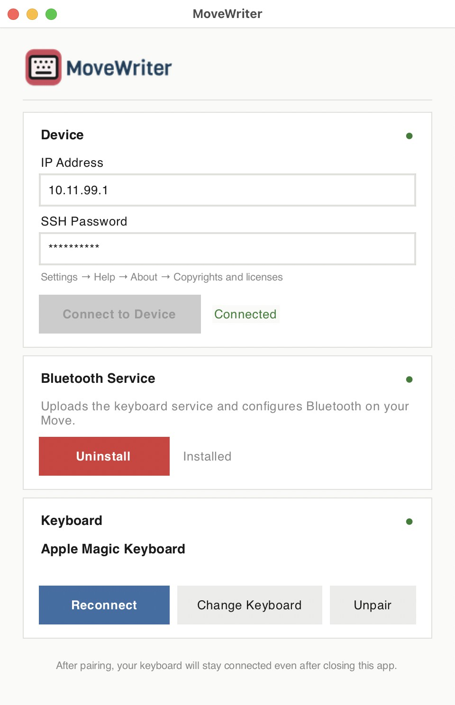

<p align="center">
  
</p>

<p align="center">
  Use a Bluetooth keyboard with your reMarkable Move.
</p>

---

> **Just want the app?** Download the ready-to-use version for Mac and Windows at [movewriter.com](https://movewriter.com). This repo is for developers who prefer to run from source.

---

<p align="center">
  
</p>

MoveWriter is a desktop app that connects to your reMarkable Move over USB and sets up Bluetooth keyboard support. Pair once, and your keyboard stays connected across reboots — no need to keep the app running.

## What it does

1. **Installs a lightweight service** on your Move that enables Bluetooth and loads the required kernel modules on every boot
2. **Pairs a Bluetooth keyboard** of your choice to the Move
3. **Auto-reconnects** the keyboard after the Move or keyboard is powered off and back on

## Requirements

- reMarkable Move connected via USB
- A Bluetooth keyboard (BT Classic or BLE)
- Python 3.10+
- macOS or Windows (for running the app)

## Setup

```bash
git clone https://github.com/yourusername/movewriter.git
cd movewriter
pip install -r requirements.txt
python main.py
```

## Usage

1. Connect your Move to your computer via USB
2. Open MoveWriter and click **Connect to Device**
   - The SSH password is found on your Move under Settings > Help > About > Copyrights and licenses
3. Click **Install** to set up the Bluetooth service
4. Put your keyboard in pairing mode, click **Scan for Keyboards**, and pair it

That's it. You can close the app — your keyboard will reconnect automatically, even after rebooting the Move.

To switch keyboards or unpair, reopen the app and use **Change Keyboard** or **Unpair**.

## How it works

MoveWriter communicates with your Move over SSH (via the USB network interface at `10.11.99.1`). It uploads a small systemd service and shell script that:

- Loads the `btnxpuart` and `uhid` kernel modules
- Configures BlueZ for keyboard input (`UserspaceHID=true`, `ClassicBondedOnly=false`)
- Powers on the Bluetooth adapter
- Reconnects your saved keyboard on boot and monitors the connection

The service and script are installed to persistent storage on the Move, so they survive reboots and firmware updates to the `/etc` overlay.

## Limitations

- PIN-based keyboards don't work — non-interactive pairing can't handle PIN entry
- After rebooting the Move, you may need to power-cycle the keyboard to wake it up for reconnection

## License

[PolyForm Noncommercial 1.0.0](LICENSE.md) — free for personal and noncommercial use.
